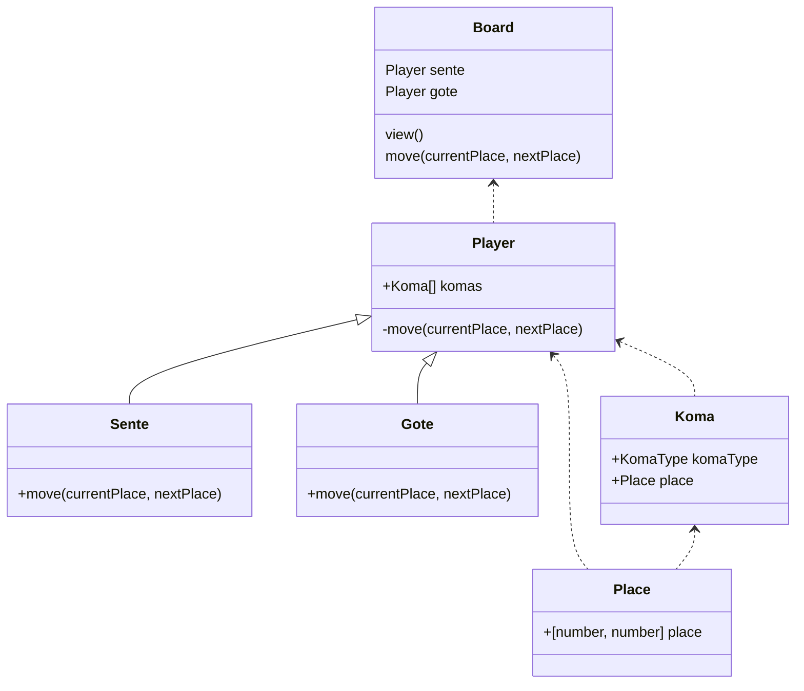
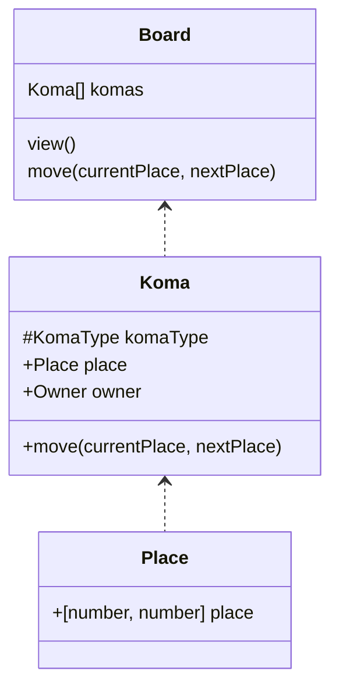
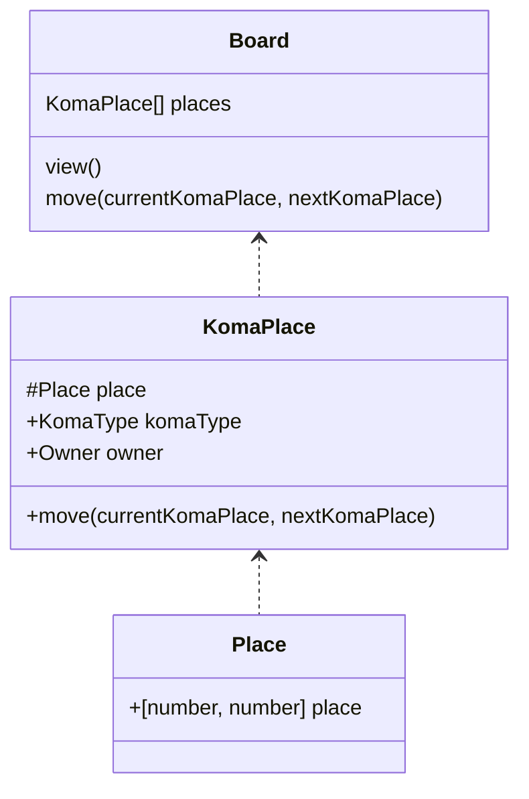

## クラス・コンポーネント図

### 初期実装

先手と後手が自身の駒を動かすので、直感的に実装できる。
拡張性がある（気がしている。）

```
review
moveは駒をnextPlaceに動かす方が自然。
{角1: 'place, owner'} 型の方が検索しやすい。
```



### 今後の課題

駒全体を固定し、駒の配置のみを変更する。データ構造は単純にできる。
同じ駒が、複数の配置を持つことがなくなる。



盤の配置を固定し、配置されている駒のみを変更する。データ構造は単純にできる。
同じ配置が、複数の駒を持つことがなくなる。


